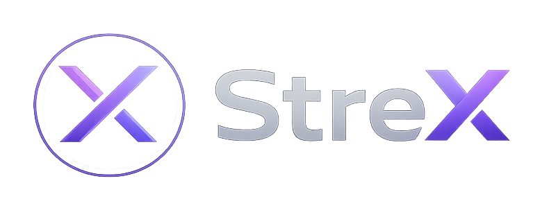

# StreX

A modern, next-gen streaming platform built for smooth, fast, and intelligent IPTV experience.

## 🔥 Overview

**StreX** is a futuristic streaming platform UI designed with a desktop OS-style interface.  
It focuses on clean UX, fast channel navigation, and a modern cyber-tech aesthetic.

This repository includes the official **StreX brand logo**, designed to match the dark neon UI system of the platform.

## 🎨 Logo

The StreX logo represents:
- A minimal **X-based identity mark**
- Neon purple gradient theme
- Dark OS-inspired visual style
- Modern streaming/tech branding

It is designed to fit perfectly in:
- IPTV desktop UI
- Streaming dashboards
- AI OS-style interfaces
- Web apps & media platforms

## 🧠 Design Philosophy

- Minimal but premium
- OS-like interface inspiration
- Neon cyber aesthetic
- High readability in dark mode environments
- Scalable for UI, favicon, and branding use

## 📁 Files

- `strex-logo.png` → Official StreX brand logo (dark UI optimized)

## 🚀 Usage

You can use the logo in:
- Web apps
- IPTV dashboards
- Mobile apps
- Branding projects
- UI headers and splash screens

## 📌 Tech Style

StreX UI theme is inspired by:

- Modern OS interfaces
- Dark mode streaming platforms
- Minimal neon cyber dashboards

## ⚡ License
This project is for personal and development use. Modify freely for your own streaming platform builds.
